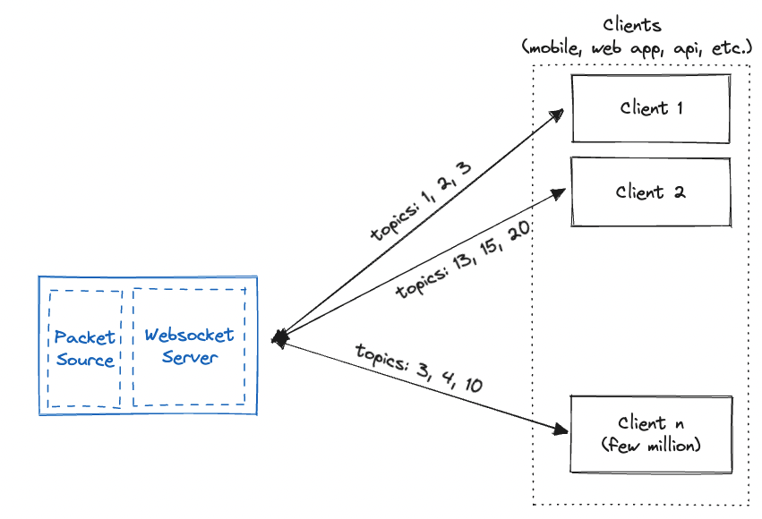

# TickTock

Build a pub/sub ticker data streaming broker.

- Each topic represents an instrument.
- Client connects via HTTP and connection upgrades to Websocket.
- Client can send a JSON-encoded TextMessage (e.g., `{"m": 0, "i": [76557, 7978]}` to subscribe to instruments).
- `m` stands for `mode` (Supported: Unsubcribe = 0, LTP = 1, LTP+Quote = 2, Full = 3) 

## Challenges

### Memory

All socket connections need to be persistent. Go HTTP server allocates 1 goroutine/request. Each goroutine starts off at 2-8 KB stack size (based on OS).

Each connection allocates 3 buffers: 2 Write Buffers (2 * 4KB) + 1 Read buffer (4KB) = 12 KB per connection.

So in total, each client will consume 8KB + 12KB = 20KB at-lest.

At 1 million connections, 20KB * 1000000 = 20GB usage.

### Fanout

A single topic can be subscribed by a lot of subscribers. The goal is to reduce the latency between a packet being generated to `conn.Write()` being invoked.

If connections are maintained as `map[int32][]WebSocketConn` and looped through, the last entry in the list will have the highest latency. If each `conn.Write()` takes 1ms, and topic X has 100 subscribers, then the 100th subscriber will get a `Write()` after 99ms.
