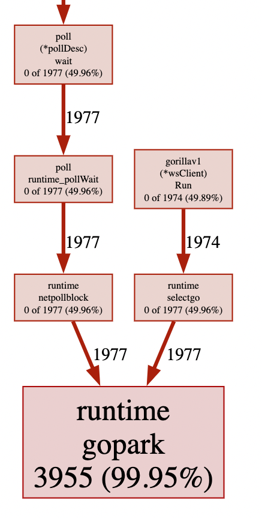

# Gorilla v1

In this model, we launch 2 goroutines per connection for reading and writing.

- Reader uses blocking IO implemented by the Go stdlib.
- The broker uses `RWMutex` to safely access the subscription map.

## Benchmark Results

Run using: `k6 run loadtest.js -d 30s -u 2000`

```
checks................: 100.00% ✓ 18000         ✗ 0
data_received.........: 78 MB   1.5 MB/s
data_sent.............: 6.1 MB  114 kB/s
iteration_duration....: avg=5.91s   min=5.04s   med=5.77s    max=7.89s p(90)=7.35s p(95)=7.63s
iterations............: 18000   337.406922/s
vus...................: 2000    min=2000        max=2000
vus_max...............: 2000    min=2000        max=2000
ws_connecting.........: avg=795.6ms min=47.28ms med=683.52ms max=2.67s p(90)=2.22s p(95)=2.51s
ws_msgs_received......: 7401606 138741.838829/s
ws_msgs_sent..........: 76224   1428.805846/s
ws_session_duration...: avg=5.91s   min=5.04s   med=5.76s    max=7.89s p(90)=7.35s p(95)=7.63s
ws_sessions...........: 18000   337.406922/s
```

Most of the time of the runtime was spent in `pollWait` from the Readers.

